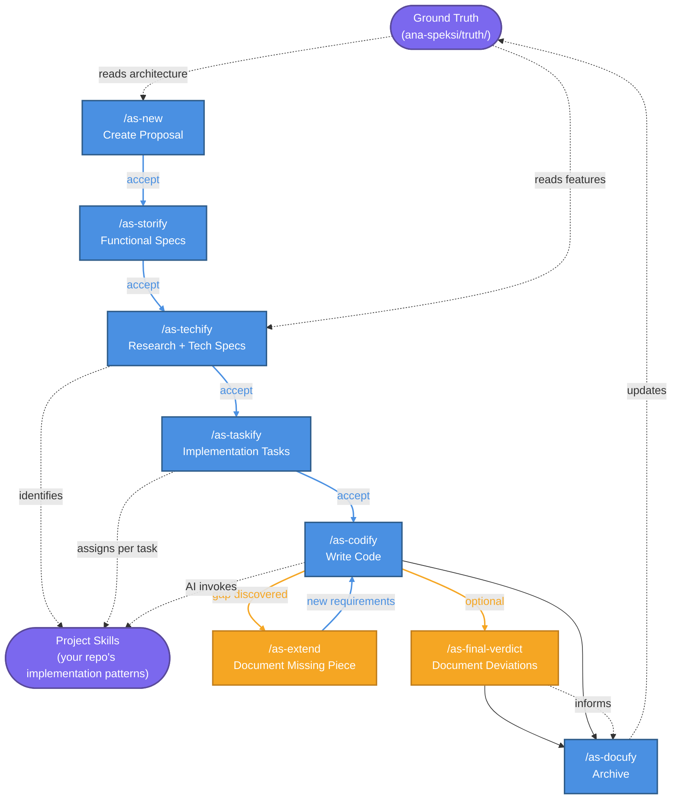

# ana-speksi

Spec-driven development framework backed up with skills.

## Philosophy

ana-speksi is a **spec-driven development framework** where every change flows through a structured specification process -- from proposal to implementation to archival. The framework is backed by **skills**: your repository contains agent skills that define how to do everything (CI/CD, API endpoints, database design, UI components, etc.). ana-speksi orchestrates this workflow, ensuring that specifications drive the code and skills ensure consistency.

All interaction happens through **agent editor commands** (slash commands like `/as-new`). The CLI exists only for initialization and housekeeping -- the real workflow is driven by your AI coding assistant.

## Installation

1. Clone ana-speksi into your project root:

```bash
git clone https://github.com/stenvala/ana-speksi.git ana-speksi-package
```

2. Add the following to your project's `pyproject.toml`:

```toml
# Add ana-speksi to your dependencies
[project]
dependencies = [
    # ... your other dependencies ...
    "ana-speksi",
]

# Register ana-speksi-package as a workspace member
[tool.uv.workspace]
members = ["ana-speksi-package"]

# Point the ana-speksi dependency to the local workspace package
[tool.uv.sources]
ana-speksi = { workspace = true }
```

3. Install dependencies:

```bash
uv sync
```

## Setup

```bash
# 1. Initialize ana-speksi in your project (generates skills + commands for your editor)
uv run ana-speksi init

# 2. After updating ana-speksi, regenerate skills without touching ana-speksi/ folder
uv run ana-speksi update
```

After init, your agent editor (Claude Code, GitHub Copilot, Cursor) has all the commands and skills available. Use them directly in the editor or CLI.

If your project already has existing code, initialize the ground truth from it:

```
/as-from-changes --codebase
```

This creates the initial `ana-speksi/truth/` hierarchy by analyzing your codebase,
so that subsequent specs can reference the existing architecture.

## Usage

All commands are used as slash commands in your AI coding assistant:

```
/as-new "add user authentication"     # Start a new change
/as-accept add-user-authentication    # Accept current phase outputs
/as-continue add-user-authentication  # Advance to the next phase
/as-codify add-user-authentication    # Start/continue implementation
/as-docufy add-user-authentication    # Archive and update ground truth
/as-from-changes --codebase           # Create truth from existing code
/as-debt-analysis src/api             # Analyze technical debt
```

Check status anytime with:

```bash
uv run ana-speksi status
```

## Workflow



The diagram shows how the workflow interacts with ground truth and your
project's own skills (external to ana-speksi):

- **as-new** reads the ground truth for architecture context when creating proposals
- **as-techify** reads existing features from truth and identifies which project skills are relevant for implementation
- **as-taskify** assigns specific project skills to each implementation task
- **as-codify** makes the AI agent invoke each task's listed skills before writing any code
- **as-extend** captures missing requirements discovered during codify, feeding them back into the implementation cycle
- **as-final-verdict** (optional) documents deferred work or implementation deviations for as-docufy to reference when archiving
- **as-docufy** syncs completed changes back into the ground truth, taking final-verdict decisions into account

Project skills (e.g., `backend-service`, `database-model`, `frontend-component`)
are defined in your repository, not in ana-speksi. They describe how to implement
things in your specific stack and conventions. ana-speksi orchestrates when and
how they are used.

Each phase has a direct command and can also be reached via `/as-continue`,
which auto-detects the next phase:

```
/as-new (proposal)
  |
  v
/as-accept (accept proposal)
  |
  v
/as-continue or /as-storify (functional specs per story)
  |
  v
/as-accept (accept proposal + functional specs)
  |
  v
/as-continue or /as-techify (research + technical specs)
  |
  v
/as-accept (accept technical specs)
  |
  v
/as-continue or /as-taskify (implementation tasks per story)
  |
  v
/as-accept (accept tasks)
  |
  v
/as-continue or /as-codify (implementation -- ONLY phase with code changes)
  |
  v (optional)
/as-final-verdict (document deferred work or implementation deviations)
  |
  v
/as-continue or /as-docufy (archive + update ground truth)
```

Each phase transition requires acceptance of the current phase's outputs
before advancing. Use `/as-accept` to review and mark outputs as Accepted.
In `/as-one-shot` mode, all outputs are auto-accepted.

## Directory Structure

```
ana-speksi/
  ongoing/        # Specs currently being worked on
  truth/          # Ground truth -- hierarchical feature documentation
  archive/        # Completed specs (prefixed with date)
  technical-debt/ # Technical debt analyses
  config.yml     # Project configuration
```

### config.yml

All project-wide settings live in `ana-speksi/config.yml`:

| Setting        | Default | Description                                                                                                                |
| -------------- | ------- | -------------------------------------------------------------------------------------------------------------------------- |
| `auto_confirm` | `false` | When `true`, the AI agent skips confirmation prompts during acceptance and commits. It still notifies you of every action. |
| `auto_story_implementation_continue` | `false` | When `true`, the AI agent automatically continues to the next story during codify without asking for confirmation between stories. |
| `context`      | (empty) | Project context injected into all skill instructions (tech stack, conventions, constraints).                               |
| `rules`        | (empty) | Per-phase rules that are injected into the corresponding skill instructions.                                               |

## Spec Structure (under ongoing/)

```
TICKET-123.feature-name/               # Folder name includes ticket ID
  proposal.md                           # High-level proposal
  index.md                              # Progress tracker (includes ticket ID refs)
  research.md                           # Technical research (created by techify)
  data-model.md                         # Data model changes (optional, one per spec)
  implementation-order.md               # Story implementation sequence (created by taskify)
  specs/
    01-story-name/
      functional-spec.md                # Functional requirements (WHEN/THEN)
      technical-spec.md                 # Technical design
      api-contract.md                   # API changes (optional)
      test-automation-plan.md           # Automated test plan (optional)
      manual-testing-plan.md            # Manual test plan (optional)
      tasks.md                          # Implementation tasks
      extension-*.md                    # Extensions discovered during codify (optional)
    02-another-story/
      ...
```

## Agent Commands

These commands are available as slash commands in your AI coding assistant:

| Command                      | Description                                                    |
| ---------------------------- | -------------------------------------------------------------- |
| `/as-new`                    | Start a new spec-driven change                                 |
| `/as-accept <name>`          | Review and accept current phase outputs                        |
| `/as-continue <name>`        | Advance to the next phase (auto-detects which)                 |
| `/as-storify <name>`         | Create functional specs (equivalent to as-continue at storify) |
| `/as-techify <name>`         | Research + create technical specs                              |
| `/as-taskify <name>`         | Create implementation tasks                                    |
| `/as-codify <name>`          | Start/continue implementation (only code-change phase)         |
| `/as-final-verdict <name>`   | Document deferred work or implementation deviations            |
| `/as-docufy <name>`          | Archive and update ground truth                                |
| `/as-one-shot <desc>`        | Run all phases without stopping (auto-accepts all)             |
| `/as-status [name]`          | Show status and acceptance readiness                           |
| `/as-from-changes`           | Create truth from existing changes/codebase                    |
| `/as-debt-analysis <target>` | Analyze technical debt (no code changes)                       |
| `/as-extend`                 | Document a missing piece discovered during implementation      |
| `/as-truth-rearrange`        | Rearrange ground truth hierarchy                               |

## CLI Commands

These are run directly in the terminal for setup and status:

| Command                                    | Description                                                  |
| ------------------------------------------ | ------------------------------------------------------------ |
| `uv run ana-speksi init`                   | Initialize ana-speksi (creates dirs, generates agent skills) |
| `uv run ana-speksi update`                 | Regenerate skills and commands (does not touch ana-speksi/)  |
| `uv run ana-speksi status`                 | Show status of all ongoing specs                             |
| `uv run ana-speksi accept [name]`          | Show acceptance status for a spec                            |
| `uv run ana-speksi truth show`             | Display the ground truth hierarchy                           |
| `uv run ana-speksi truth rearrange <desc>` | Reorganize ground truth                                      |

## Phase Skills

Each phase has a corresponding agent skill that provides detailed instructions:

| Phase              | Skill              | What It Does                                            |
| ------------------ | ------------------ | ------------------------------------------------------- |
| Proposal           | as-new             | Creates proposal.md with problem, stories, requirements |
| Accept             | as-accept          | Reviews and marks phase outputs as Accepted             |
| Storify            | as-storify         | Creates functional specs with WHEN/THEN scenarios       |
| Research + Techify | as-techify         | Research + technical specs per story                    |
| Taskify            | as-taskify         | Creates task lists referencing skills                   |
| Codify             | as-codify          | Implements tasks (ONLY code change phase)               |
| Extension          | as-extend          | Documents missing pieces discovered during codify       |
| Final Verdict      | as-final-verdict   | Documents deferred work and implementation deviations   |
| Docufy             | as-docufy          | Archives spec, updates ground truth                     |

## Ad Hoc Workflows

### Retroactive Documentation

```
/as-from-changes --staged        # From staged changes
/as-from-changes --commit abc123 # From a specific commit
/as-from-changes --codebase      # Initialize truth for entire codebase
```

### Story Extensions

When you discover a critical missing piece during implementation (codify phase),
use `/as-extend` to document it as a story extension:

```
/as-extend "error handling for batch uploads"   # Document a missing requirement
```

Extensions capture entirely new functionality not in the original spec -- not
iterations or refinements, but new requirements discovered while coding. They are
placed under the relevant story as `extension-*.md` files and tracked in index.md.

### Technical Debt

```
/as-debt-analysis src/api              # Analyze a folder
/as-debt-analysis database-design      # Analyze against a skill
/as-new --from-debt ana-speksi/technical-debt/2026-02-10-src-api.md  # Then clear the debt
```

## Supported Agent Frameworks

| Framework      | Skills Location   | Commands/Prompts Location |
| -------------- | ----------------- | ------------------------- |
| Claude Code    | `.claude/skills/` | `.claude/commands/`       |
| GitHub Copilot | `.github/skills/` | `.github/prompts/`        |
| Cursor         | `.cursor/rules/`  | `.cursor/commands/`       |

## Acceptance Workflow

Every spec document has a `**Status**` field that tracks its acceptance state:

| Status   | Meaning                          |
| -------- | -------------------------------- |
| Draft    | Document created, pending review |
| Accepted | Reviewed and approved by user    |

Phase transitions are gated by acceptance:

| To Advance To | Must Accept                          |
| ------------- | ------------------------------------ |
| storify       | proposal.md                          |
| techify       | proposal.md + all functional-spec.md |
| taskify       | all technical-spec.md                |
| codify        | all tasks.md                         |

Use `/as-accept` to review and mark outputs as Accepted. The AI agent will present
each file for review and ask for confirmation before changing status.

In `/as-one-shot` mode, all documents are auto-accepted immediately after creation.

## Document Status in index.md

Progress is tracked in index.md using status indicators (not checkboxes):

```
- [] [research.md](research.md)                    # Not created yet
- [Draft] [functional-spec.md](path)               # Created, pending review
- [Accepted] [functional-spec.md](path)             # Reviewed and accepted
```

## Generated With

All key documents include a `**Generated with**` header field that tracks
which command created them (e.g., `as-new`, `as-storify`, `one-shot`).

## Key Principles

1. **Spec-driven**: Every change starts with a specification before code
2. **Skill-backed**: Every task references a development skill from the repo
3. **Acceptance-gated**: Phase transitions require explicit approval of outputs
4. **No branch management**: User handles git branching
5. **Code changes only in codify**: All other phases are documentation only
6. **Hierarchical truth**: Ground truth reflects how features build on each other
7. **No emojis**: Clean, professional documentation
8. **Templates are editable**: All markdown lives in skill files that users can customize

## Example Skills

ana-speksi tasks reference skills that define how to implement things in your project. Here are typical skills you might have:

| Category         | Skills                                                                                                   | Purpose                                                   |
| ---------------- | -------------------------------------------------------------------------------------------------------- | --------------------------------------------------------- |
| **Backend**      | `backend-service`, `backend-router`, `backend-test`                                                      | Service layer, API routing, backend tests                 |
| **Frontend**     | `frontend-component`, `frontend-service`, `frontend-store`, `frontend-dialog`, `frontend-forms`          | UI components, services, state management, dialogs, forms |
| **Database**     | `database-design`, `database-model`, `database-repository`, `database-schema-edit-*`, `database-setup-*` | Schema design, ORM models, data access, migrations        |
| **Testing**      | `backend-test`, `integration-test`, `e2e-test`                                                           | Unit, integration, and end-to-end testing                 |
| **Code Quality** | `code-simplifier`, `commit`                                                                              | Refactoring, git commit conventions                       |
| **DevOps**       | `ci-cd`, `infrastructure-as-code`                                                                        | CI/CD pipelines, infrastructure provisioning              |
| **Project**      | `create-project`, `skill-creator`                                                                        | Project scaffolding, creating new skills                  |

Skills are project-specific. You define them to match your stack and conventions.
